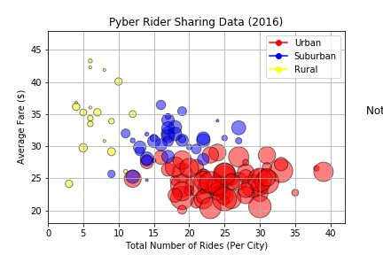
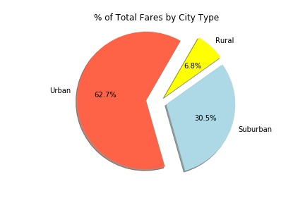

# MatPlotLib Challenge
The power of Plots

## Background

What good is data without a good plot to tell the story?

In this challenge, we are using Python Matplotlib and apply it to some real-world situations. 

## Pyber (Hypothetical Ride Sharing Company)

The ride sharing bonanza continues! Seeing the success of notable players like Uber and Lyft, I've decided to join a fledgling ride sharing company of my own. 
In my latest capacity, I'll be acting as Chief Data Strategist for the company. In this role, I'll be expected to offer data-backed guidance on new opportunities for market differentiation.

I've since been given access to the company's complete recordset of rides. This contains information about every active driver and historic ride, including details like city, driver count, individual fares, and city type.

The objective is to build a [Bubble Plot](https://en.wikipedia.org/wiki/Bubble_chart) that showcases the relationship between four key variables:

* Average Fare ($) Per City
* Total Number of Rides Per City
* Total Number of Drivers Per City
* City Type (Urban, Suburban, Rural)

In addition, we produce the following three pie charts:

* % of Total Fares by City Type
* % of Total Rides by City Type
* % of Total Drivers by City Type

## Pymaceuticals (Hypothetical Pharmaceutical Company)

While the data companions rushed off to jobs in finance and government, we remained adamant that science was the way for us. Staying true to the mission, we've since joined Pymaceuticals Inc., a burgeoning pharmaceutical company based out of San Diego, CA. Pymaceuticals specializes in drug-based, anti-cancer pharmaceuticals. In their most recent efforts, they've since begun screening for potential treatments to squamous cell carcinoma (SCC), a commonly occurring form of skin cancer.

As their Chief Data Analysts, we've been given access to the complete data from their most recent animal study. In this study, 250 mice were treated through a variety of drug regimes over the course of 45 days. Their physiological responses were then monitored over the course of that time. Our objective is to analyze the data to show how four treatments (Capomulin, Infubinol, Ketapril, and Placebo) compare.

To do this we are tasked with:

* Creating a scatter plot that shows how the tumor volume changes over time for each treatment.
* Creating a scatter plot that shows how the number of [metastatic](https://en.wikipedia.org/wiki/Metastasis) (cancer spreading) sites changes over time for each treatment.
* Creating a scatter plot that shows the number of mice still alive through the course of treatment (Survival Rate)
* Creating a bar graph that compares the total % tumor volume change for each drug across the full 45 days.

Notes for this project:

* Use the Pandas Library and the Jupyter Notebook.
* Use the Matplotlib library.
* Include a written description of three observable trends based on the data.
* Use proper labeling of your plots, including aspects like: Plot Titles, Axes Labels, Legend Labels, X and Y Axis Limits, etc.
* The scatter plots must include [error bars](https://en.wikipedia.org/wiki/Error_bar). This will allow the company to account for variability between mice. 
* Remember when making the plots to consider aesthetics!
  * The legends should not be overlaid on top of any data.
  * The bar graph should indicate tumor growth as red and tumor reduction as green.
  * It should also include a label with the percentage change for each bar. 

